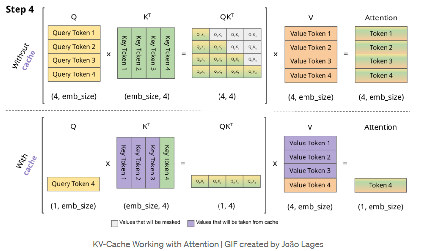

# KV Caching


## Principle of KV caching

- During autoregressive text generation, the K and V matrices are updates with each new token that is processed

- For example, when token 1 is passed, the model computes K1 and  V1, then when token 2 is passed, along with K2 and V2, K1 and V1 are computed again. yikes (see reference image). This means slow inference.

KV caching stores the K and V values upto the nth token so we can just access these values instead of computing them again. 

The biggest advantage of kv caching is that the responses become faster since the same K and V need not be re-computed everytime.

This system, however, comes at the cost of increased VRAM usage during inference. Especially when the sequence length is long

## Example
```
Without KV caching:

Step 1: Token 1
K1, V1 computed

Step 2: Token 2
K1, V1 recomputed
K2, V2 computed

Step 3: Token 3
K1, V1 recomputed
K2, V2 recomputed
K3, V3 computed
...

With KV caching:

Step 1: Token 1
K-cache = [K1]
V-cache = [V1]

Step 2: Token 2
K-cache = [K1, K2]
V-cache = [V1, V2]

Step 3: Token 3
K-cache = [K1, K2, K3]
V-cache = [V1, V2, V3]
```
Notice how only new token's K and V are computed each step in caching
