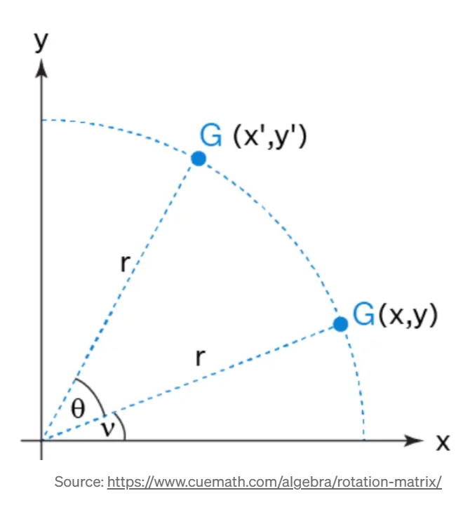
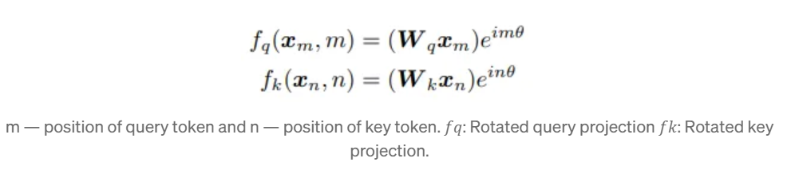
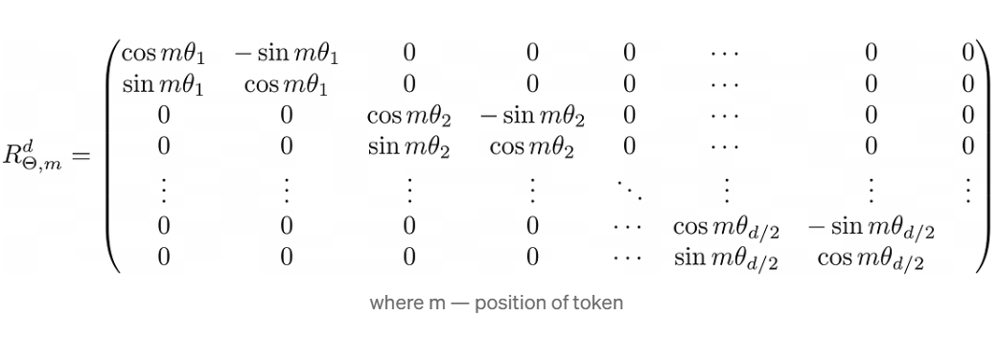
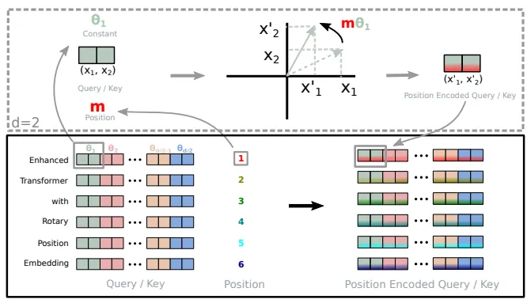

# RoPE (or) Rotary positional embeddings

## Classic positional encoding can be represented like this:

- p(i, 2t)   = sin(i / (10000^(2t/d)))
- p(i, 2t+1) = cos(i / (10000^(2t/d)))

where d is the dimensionality of the embedding 
i is the index of the word in that vector
t is the index of the dimension in the embedding vector

However, this method has two big disadvantages:

- Limited sequence length: Fixed position vectors are predefined, so the model is trained only on sequences of a certain maximum length.
- Lack of information about the distance between words: The difference between absolute positional vectors does not reflect how close or far words are
  from each other in context

Imagine two sentences:
- “He took on the challenge bravely.”
- “Bravely, he took on the challenge.”

In both cases, the word “bravely” has a different absolute positional representation, although in both sentences the semantic position of the word relative to the others is almost identical.

Since positional encoding is sequential (i.e., token in pos 0 gets a value, pos 1 another value), sometimes the words may end up with different
encodings, even if they serve the same sentence in a given context (or thats how im understanding it).

## Where RoPE comes in



(figure: rotating a 2d vector)

RoPE encodes the position of a token by applying rotations to the token embedding using the distance between two tokens rather than the number of the token in the sentence



Let's say we wanna rotate a 2d vector in a cartesian plan by angle theta. To acheive that, we can rotate it by multiplying it with a 2d matrix R(theta)

```
R(theta) = [
            [cos(theta), -sin(theta)],
            [sin(theta), cos(theta)]
           ]
```

Now consider the more complicated case where a vector consists of d dimensions (d is divisible by 2). In such a case, we can divide this vector into d/2 two-dimensional vectors, which we can easily rotate. In this case, the original vector is transformed by this matrix:


3️⃣ Forward Function

Important: In your code, forward is indented inside __init__, which is incorrect.
It should be at class level, not inside __init__.

def forward(self, q, k, seq_len=None):
    if seq_len is None:
        seq_len = q.shape[-2]

    cos = self.cos[:seq_len, :].unsqueeze(0).unsqueeze(0)  # [1,1,seq_len,dim/2]
    sin = self.sin[:seq_len, :].unsqueeze(0).unsqueeze(0)


Slices only the needed positions.

Unsqueeze to make them broadcastable over [batch, heads, seq_len, dim/2].

3a. Rotate half helper
def rotate_half(x):
    x1 = x[..., ::2]
    x2 = x[..., 1::2]
    return torch.stack((-x2, x1), dim=-1).reshape_as(x)


Rotates each pair (x_0, x_1) by 90° in 2D plane.

Works because: [x0,x1] → [-x1,x0]
In other words, for each token, we take the first two values of its embedding, rotate them by theta_i angle and the result is the first two values of the final vector. We do the same with the next pair and so on.



So basically,

- Rotary Positional Embeddings (RoPE) rotate token embeddings in 2D pairs based on their absolute positions.
- Each attention head applies RoPE independently to its own head dimension, split into rotation pairs.
- Attention computes a full S × S dot-product between queries and keys, using the rotated embeddings.
- Relative positional information emerges naturally from the phase differences between rotated vectors.
- Multiple heads provide different “views” of token relationships, capturing rich positional patterns across the sequence.
